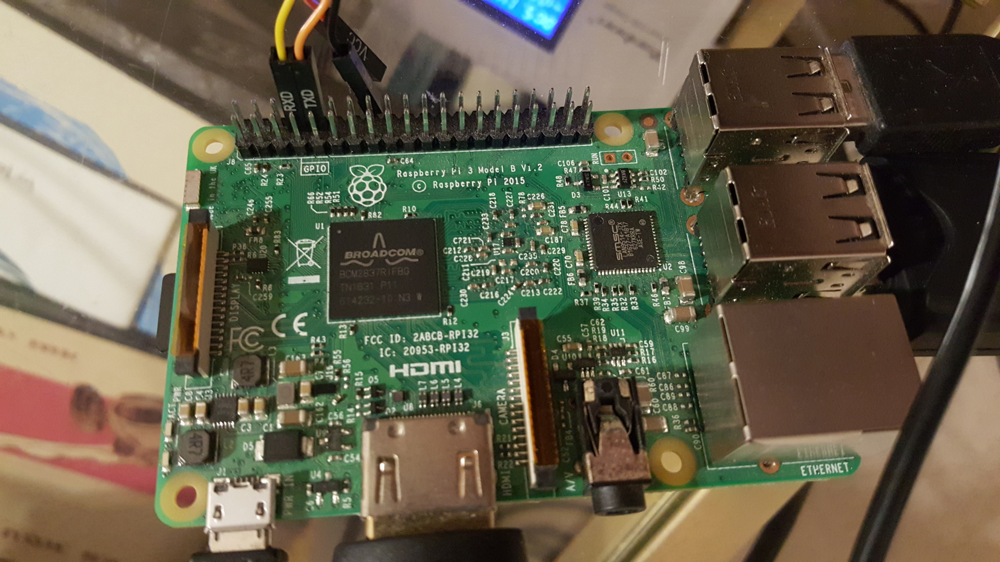

# Running on host

MIX_TARGET=host mix deps.get
MIX_TARGET=host iex -S mix scenic.run

# Running on RPI3

MIX_TARGET=adsb_nerves_rpi3 mix deps.get
MIX_TARGET=adsb_nerves_rpi3 mix firmware.burn

# Connecting over UART

Connect RX and TC to pins 8, 10

Run `screen /dev/ttyUSB0 115200`

## Pin Diagram

